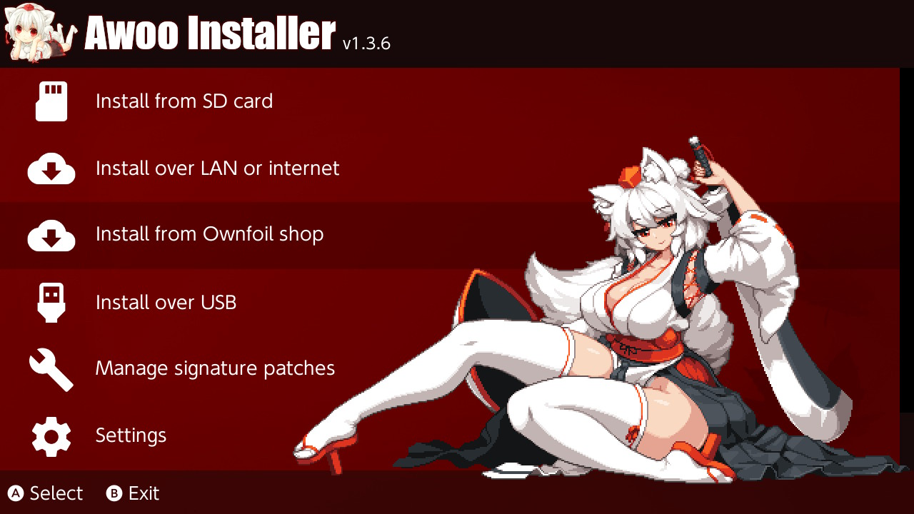
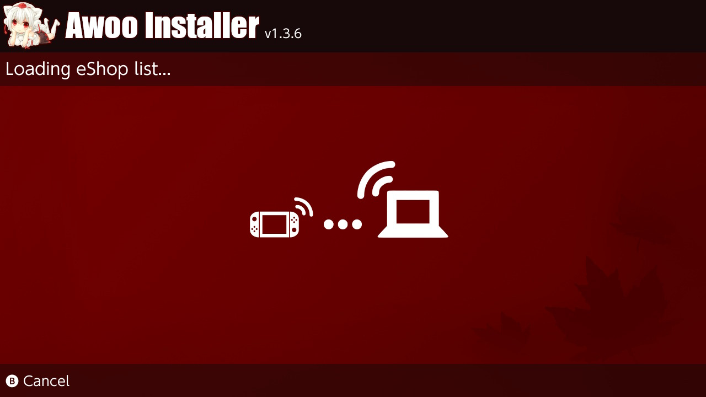
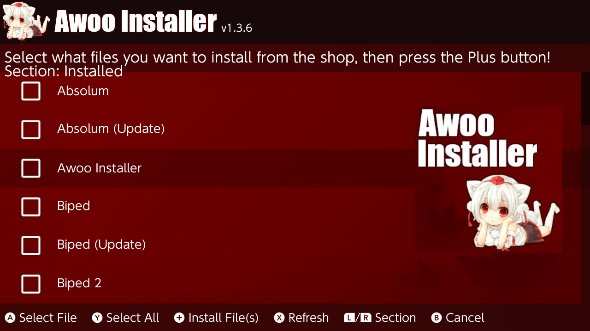
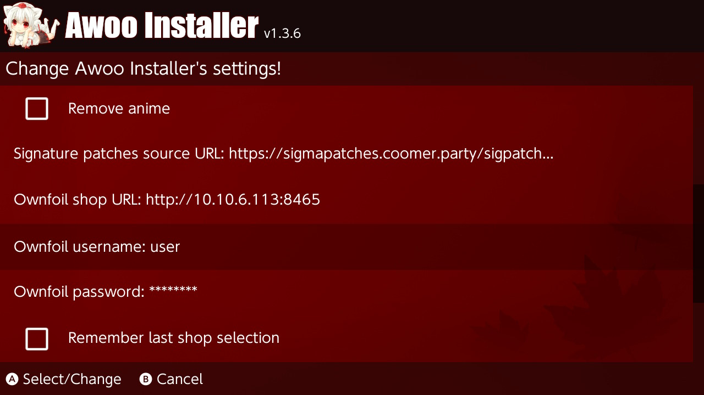

# Awoo Installer
A No-Bullshit NSP, NSZ, XCI, and XCZ Installer for Nintendo Switch

## Features
- Installs NSP/NSZ/XCI/XCZ files and split NSP/XCI files from your SD card
- Installs NSP/NSZ/XCI/XCZ files over LAN or USB from tools such as [NS-USBloader](https://github.com/developersu/ns-usbloader)
- Installs NSP/NSZ/XCI/XCZ files over the internet by URL or Google Drive
- Verifies NCAs by header signature before they're installed
- Installs and manages the latest signature patches quickly and easily
- Based on [Adubbz Tinfoil](https://github.com/Adubbz/Tinfoil)
- Uses [XorTroll's Plutonium](https://github.com/XorTroll/Plutonium) for a pretty graphical interface
- Just werks

## Why?
Because Goldleaf tends to not "Just werk" when installing NSP files. I wanted a *free software* solution that installs, looks pretty, and doesn't make me rip my hair out whenever I want to put software on my Nintendo Switch. Awoo Installer does exactly that. It installs software. That's about it!

If you want to do other things like manage installed tickets, titles, and user accounts, check out [Goldleaf](https://github.com/XorTroll/Goldleaf)!

## Shop
Awoo Installer supports an Ownfoil-compatible shop with sections, search, and cover art previews.

Setup:
- Run Ownfoil and note its host/port (example: `http://192.168.1.2:8465`).
- In Awoo settings, set Shop URL, Username, and Password (optional).
- If your shop is private, make sure credentials are correct.

Browsing:
- L/R switches sections (New, Recommended, Updates, DLC, All, Installed).
- ZR searches in the All section.
- The right-side panel shows the cover art for the focused entry.

Updates and DLC:
- Updates/DLC show only when the base title is installed.
- Updates list only shows updates newer than the installed version.

Install flow:
- Select one or more base titles and press Plus to install.
- Awoo can prompt to include available updates for selected titles.

Notes:
- Encrypted Ownfoil responses are not supported in Awoo.
- The Installed section lists content already on the Switch and cannot be installed from.

Screenshots:

## Thanks to
- HookedBehemoth for A LOT of contributions
- Adubbz and other contributors for [Tinfoil](https://github.com/Adubbz/Tinfoil)
- XorTroll for [Plutonium](https://github.com/XorTroll/Plutonium) and [Goldleaf](https://github.com/XorTroll/Goldleaf)
- blawar (wife strangulator) and nicoboss for [NSZ](https://github.com/nicoboss/nsz) support
- The kind folks at the AtlasNX Discuck (or at least some of them)
- The also kind folks at the RetroNX Discuck (of no direct involvement)
- [namako8982](https://www.pixiv.net/member.php?id=14235616) for the Momiji art
- TheXzoron for being a baka
